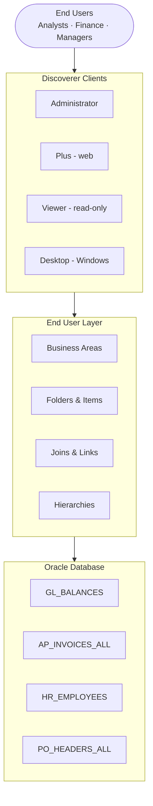
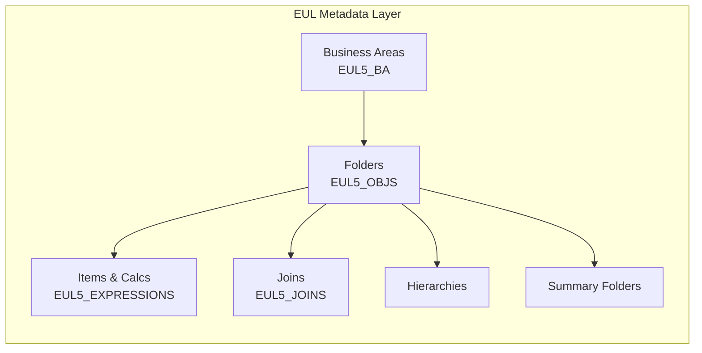
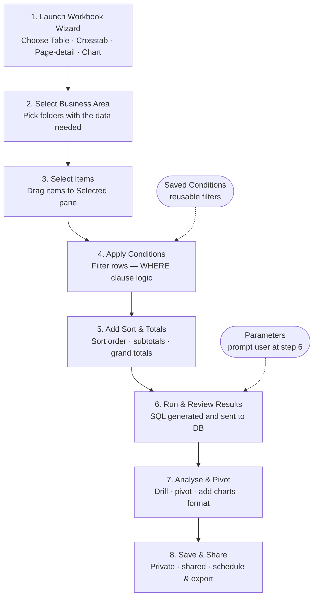
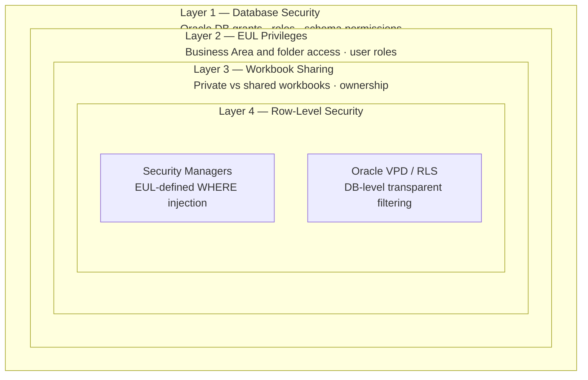
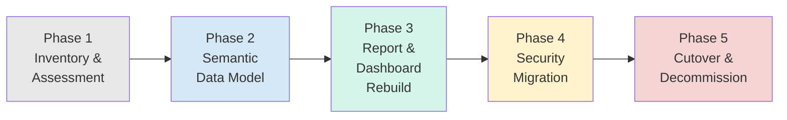
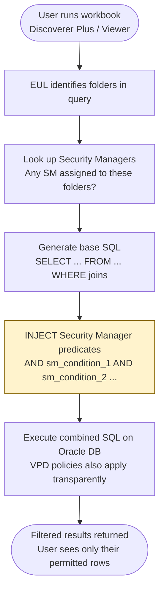
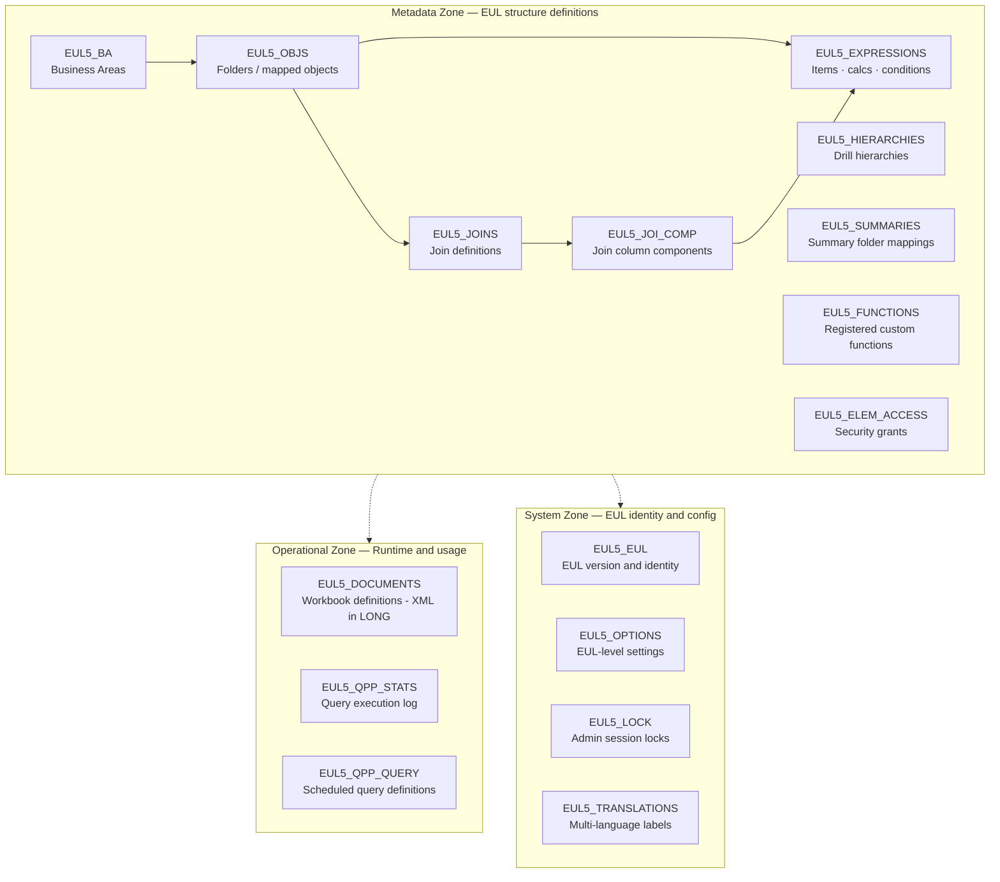
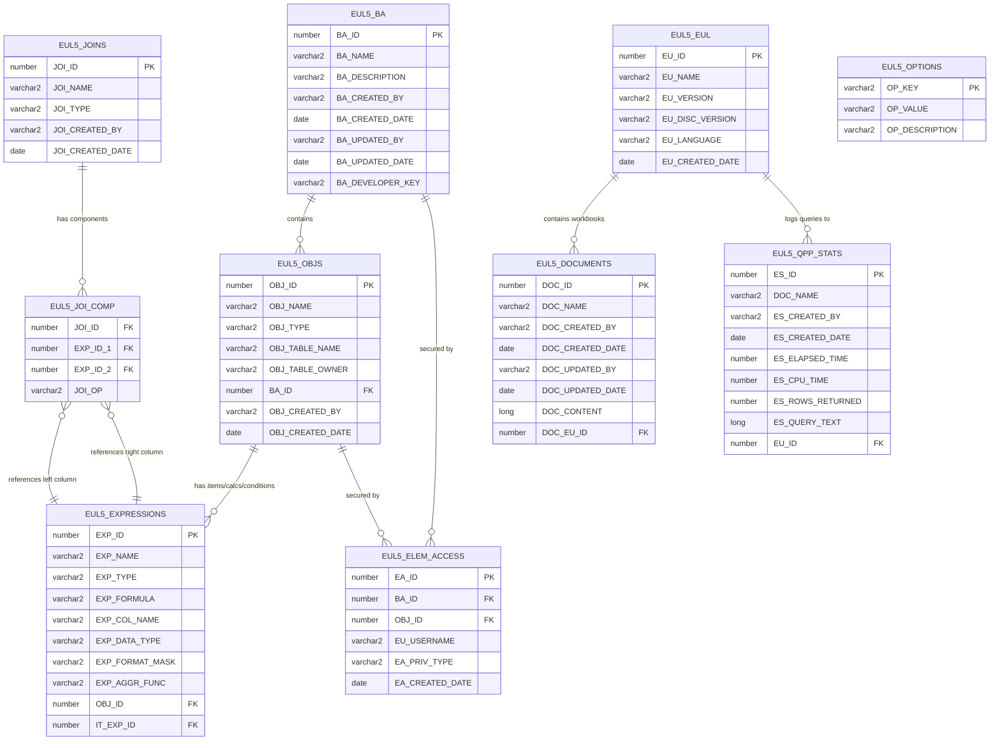

# Oracle Discoverer — Complete Technical Reference

> ## ⚠️ §8 (EUL database table schema) IS NOT ACCURATE
>
> Verified 2026-08-20 against Oracle's shipped scripts in
> `discoverer10g/sql/`: the EUL table and column names in §8 — and in the
> ER diagrams and sample queries that use them — describe a schema that does
> not exist. `EUL5_BA`, `EUL5_JOINS`, `EUL5_JOI_COMP`, `EUL5_ELEM_ACCESS`,
> `EUL5_EUL`, `EUL5_OPTIONS`, `OBJ_TABLE_NAME`, `EXP_COL_NAME` are all
> fabricated; the real names are `EUL5_BAS`, `EUL5_KEY_CONS`,
> `EUL5_HI_NODES`/`EUL5_HI_SEGMENTS`, `EUL5_ACCESS_PRIVS`, `EUL5_VERSIONS`,
> `SOBJ_EXT_TABLE`, `IT_EXT_COLUMN`.
>
> For EUL table/column detail use
> [`discoverer-neo/migrate/EUL_SCHEMA_GROUND_TRUTH.md`](discoverer-neo/migrate/EUL_SCHEMA_GROUND_TRUTH.md).
> The rest of this document (architecture, components, concepts, migration
> strategy) is unaffected.

> **Status:** Desupported by Oracle (Premier Support ended December 2012).  
> **Replacement:** Oracle Analytics Cloud (OAC) / Oracle Analytics Server (OAS).  
> This document covers Oracle Discoverer 10g / 11g with EUL version 5.

---

## Table of Contents

1. [Overview](#1-overview)
2. [End User Layer (EUL) — Architecture & Setup](#2-end-user-layer-eul--architecture--setup)
3. [Workbook Building](#3-workbook-building)
4. [Security Configuration](#4-security-configuration)
5. [Migration to Oracle Analytics Cloud](#5-migration-to-oracle-analytics-cloud)
6. [EUL Security Manager Conditions](#6-eul-security-manager-conditions)
7. [Analytic Functions in Workbooks](#7-analytic-functions-in-workbooks)
8. [EUL Database Table Schema](#8-eul-database-table-schema)

---

## 1. Overview

Oracle Discoverer is an end-user query, reporting, and data analysis tool that allows business users and analysts to extract, analyse, and present data from Oracle databases **without writing SQL**. It uses an abstraction layer called the **End User Layer (EUL)** to shield users from the complexity of the underlying database schema.

### 1.1 Core Components

| Component | Type | Purpose |
|---|---|---|
| **Discoverer Administrator** | Desktop / Server | Builds and manages the EUL; controls security |
| **Discoverer Plus** | Java web client | Full query and workbook creation for power users |
| **Discoverer Viewer** | Lightweight browser | Read-only viewing and export of pre-built reports |
| **Discoverer Desktop** | Windows fat client | Legacy full-featured local client |
| **Discoverer Portlet Provider** | Oracle Portal integration | Embeds reports and charts in web portal pages |

### 1.2 Architecture — How It Works



**Execution flow:**
1. The DBA/Administrator sets up the EUL — mapping raw DB tables to friendly Business Areas and folder items.
2. The end user logs into Discoverer Plus or Viewer via browser or client.
3. The user selects items from Business Areas and builds a **Workbook**.
4. Discoverer **generates the SQL** behind the scenes and submits it to the Oracle database.
5. Results are returned and displayed in a formatted **Worksheet** that can be pivoted, drilled, charted, and exported.

### 1.3 Key Functionalities

**Querying & Reporting**
- Ad-hoc querying without SQL knowledge
- Drag-and-drop interface to build queries visually
- Multiple worksheets within a single workbook
- Cross-tabulation (pivot) reports, tabular and matrix layouts

**Data Analysis**
- Drill-down and drill-up through data hierarchies (Year → Quarter → Month → Day)
- Drill-out to related data in other workbooks
- Interactive pivoting of rows and columns
- Sorting, filtering, and ranking
- Totals, subtotals, grand totals, running totals, percentages

**Charting & Visualisation**
- Bar, line, pie, area, scatter, Gantt, High-Low-Close, Pareto, Combination charts
- Charts embedded directly in worksheets, interactive chart-to-table linking

**Parameters & Conditions**
- User-defined parameters (prompts at runtime for dynamic filtering)
- Saved conditions (predefined filters reusable across queries)
- Complex AND/OR condition logic
- Date-range filtering and relative date conditions

**Calculations & Analytics**
- Analytic functions: running sum, moving average, rank, lag/lead
- Custom calculated items and columns
- Aggregate functions: SUM, AVG, COUNT, MIN, MAX
- Percentile and variance functions

**Export & Sharing**
- Export to Microsoft Excel, CSV, HTML, PDF, and text
- Public and private workbook sharing
- Scheduling: reports run at defined times, results emailed or saved

### 1.4 Integration
- Oracle E-Business Suite (EBS) — financial, HR, purchasing, operational reporting
- Oracle Portal — dashboard embedding via Portlet Provider
- Oracle OLAP — multidimensional analysis
- Any Oracle database schema (not only EBS)

### 1.5 Typical Use Cases
- Financial reporting (GL, AP, AR balances and transactions)
- HR and payroll analysis
- Inventory and supply chain reporting
- Sales and order analysis
- Executive dashboards
- Custom operational reports replacing manual spreadsheets

---

## 2. End User Layer (EUL) — Architecture & Setup

The EUL is the backbone of Oracle Discoverer. It is a metadata layer physically stored as ~50 Oracle database tables (owned by the EUL schema user, e.g. `EUL5_US`). Everything a user sees — folder names, column labels, joins, hierarchies — is defined here.

### 2.1 EUL Structural Overview



### 2.2 Step-by-Step EUL Setup

#### Step 1 — Create the EUL Schema
- A dedicated Oracle DB user (e.g. `EUL5_US`) is created to own the EUL tables.
- The EUL installation script (`eulbuilder.sql`) creates ~50 system tables prefixed `EUL5_`.
- A separate EUL can exist per language (`EUL5_US` for English, `EUL5_FR` for French, etc.).

#### Step 2 — Connect Discoverer Administrator
- Log in using a DBA-level account or the EUL owner.
- Point to the correct EUL schema.
- A blank EUL is now ready to be populated.

#### Step 3 — Create Business Areas
A Business Area is the top-level grouping visible to users — equivalent to a "module" or "subject area":
- Examples: *Accounts Payable*, *General Ledger*, *HR & Payroll*, *Sales Analysis*
- Each Business Area contains one or more **Folders**
- Users are granted access at the Business Area level

#### Step 4 — Define Folders
Folders map to database tables or views. Each folder has:
- A **name** (user-friendly, e.g. "Invoice Headers" instead of `AP_INVOICES_ALL`)
- A **database object** (table, view, or synonym)
- **Items** (columns — each can be renamed, formatted, hidden)
- A **type**: Simple (one table), Complex (custom SQL), or Joined (pre-joined result)

**Folder types:**

| Type | Description |
|---|---|
| `TABLE` | Direct mapping to a database table |
| `VIEW` | Mapping to a database view |
| `DERIVED` | Built from other folders, no direct DB object |
| `COMPLEX` | Based on a custom SQL SELECT statement |
| `JOIN` | Pre-joined folder combining multiple tables |
| `SUMMARY` | Mapped to a pre-aggregated summary table |

#### Step 5 — Configure Items
Each column within a folder becomes an Item:

| Property | Description |
|---|---|
| Display name | e.g. `INVOICE_AMOUNT` → "Invoice Amount" |
| Data type & format | Currency, date format, decimal places |
| Item type | Dimension (e.g. Supplier Name) vs Measure (e.g. Invoice Total) |
| Default aggregation | SUM, COUNT, AVG, MIN, MAX |
| Visibility | Hidden from users by default or always visible |

#### Step 6 — Define Joins
Joins tell Discoverer how folders relate so it can write multi-table SQL:
- Equivalent to foreign key relationships in the database
- Can be **inner joins** or **outer joins**
- Must be explicitly defined even if FK constraints exist in the DB
- Discoverer uses these to auto-generate WHERE clause joins

#### Step 7 — Build Hierarchies
Hierarchies power drill-down/drill-up behaviour:

| Hierarchy | Levels |
|---|---|
| Time | Year → Quarter → Month → Week → Day |
| Geography | Country → Region → City |
| Organisation | Company → Division → Department → Cost Centre |

#### Step 8 — Create Calculated Items & Conditions
- Pre-built calculations stored in the EUL and reusable by all users
  - Example: `Gross Margin = Revenue − COGS`
- Pre-built conditions applied as defaults
  - Example: `Active Employees Only = TERMINATION_DATE IS NULL`

#### Step 9 — Set Summary Folders (Aggregates)
Summary Folders are pre-aggregated tables the EUL routes queries to automatically:
- Instead of querying millions of transaction rows, Discoverer redirects to a pre-summarised table
- Dramatically improves performance for large data sets
- Defined with: source folder, aggregate function, aggregation level, physical target table

---

## 3. Workbook Building

A **Workbook** in Discoverer is equivalent to an Excel file — it contains one or more **Worksheets**, each a separate query/report.

### 3.1 Workbook Creation Flow



### 3.2 Worksheet Types

**Table Worksheet**
Standard row-by-column grid. Best for transactional detail (invoice lists, employee records, purchase orders). Supports sorting, totals, and conditional formatting.

**Crosstab (Pivot) Worksheet**
Data arranged with dimensions on both axes. Ideal for comparing measures across two dimensions simultaneously (e.g. Revenue by Month across Product Categories). Rows and columns can be swapped interactively.

**Page-Detail Worksheet**
Adds a "page axis" — a third dimension controlled by a dropdown. For example, a crosstab of Revenue by Month, paged by Region. Users flip through pages without re-querying.

**Chart Worksheet**
Graphical view of data. Can be standalone or linked to a Table or Crosstab on the same worksheet. Supported chart types: Bar (vertical/horizontal/stacked), Line, Pie, Area, Scatter, Gantt, High-Low-Close, Pareto, Combination.

### 3.3 Conditions — In Depth

Conditions are the WHERE clause logic of Discoverer:

| Type | Example |
|---|---|
| Single-item | `Invoice Status = 'APPROVED'` |
| Compound | Multiple conditions linked with AND / OR |
| Parameter-driven | Value supplied at runtime — e.g. *"Enter Start Date:"* |
| In-list | `Supplier Name IN ('Supplier A', 'Supplier B')` |
| Subquery | `Employee ID IN (SELECT employee_id FROM ...)` |
| Saved | Stored in the EUL by the administrator, reusable globally |

Conditions can be applied at the **worksheet level** (post-aggregation, equivalent to HAVING) or the **data level** (pre-aggregation, equivalent to WHERE).

### 3.4 Calculations — Function Reference

| Category | Functions |
|---|---|
| Arithmetic | `+`, `-`, `*`, `/`, `MOD`, `POWER`, `SQRT`, `ABS`, `ROUND`, `CEIL`, `FLOOR` |
| String | `INITCAP`, `UPPER`, `LOWER`, `SUBSTR`, `INSTR`, `LENGTH`, `LPAD`, `RPAD`, `TRIM`, `REPLACE`, `CONCAT` |
| Date | `SYSDATE`, `MONTHS_BETWEEN`, `ADD_MONTHS`, `TRUNC`, `TO_DATE`, `TO_CHAR`, `LAST_DAY` |
| Conditional | `DECODE`, `CASE WHEN … THEN … ELSE … END`, `NVL`, `NVL2`, `NULLIF` |
| Analytic | `RANK()`, `DENSE_RANK()`, `ROW_NUMBER()`, `LAG()`, `LEAD()`, `SUM() OVER()`, `AVG() OVER()` |

### 3.5 Drilling — Three Types

**Drill Down / Drill Up** — navigates a pre-defined hierarchy. Year → Quarter → Month → Day. Drill Up reverses direction.

**Drill to Detail** — from an aggregated view, drill to underlying transactional records. Example: from a summarised invoice total by supplier → individual invoices for that supplier.

**Drill Out** — navigate from the current workbook to a different workbook, passing context. Example: click a Supplier Name → Discoverer opens a detailed supplier workbook pre-filtered to that supplier.

### 3.6 Exporting & Scheduling

**Export formats:** Excel (`.xls`), Excel 2000, CSV, HTML, plain text, PDF

**Scheduling:**
- Define a schedule (one-time, daily, weekly, monthly)
- Specify output format and destination (saved to DB, emailed, exported to file)
- Results stored as Scheduled Workbook Results viewable later
- Requires the Discoverer Scheduling database (a separate schema install)

---

## 4. Security Configuration

Security in Discoverer operates across four distinct layers, each complementing the others.

### 4.1 Security Layers Overview



### 4.2 Layer 1 — Database Security

The foundation. Discoverer connects to Oracle as a specific user. Controls:
- **Schema-level grants:** Which tables and views the connecting user can SELECT from
- **Database roles:** Oracle roles (e.g. `APPS_READONLY`) bundling permissions
- **Connection method:** Oracle username/password, or EBS responsibility-based login

> If a user cannot SELECT from `AP_INVOICES_ALL` at the DB level, no EUL configuration can override that.

### 4.3 Layer 2 — EUL Privileges

In Discoverer Administrator, the EUL administrator controls what users can see and do:

| Privilege | Access level |
|---|---|
| `DISCOVERER_USER` | Run existing workbooks only |
| `DISCOVERER_PLUS` | Create and run workbooks in Discoverer Plus |
| `DISCOVERER_VIEWER` | Read-only Viewer access |
| `DISCOVERER_ADMIN` | Full administrative access |

**Business Area Grants** — the administrator explicitly grants access to Business Areas:
- A user with `DISCOVERER_PLUS` but no Business Area access sees nothing
- Grants can be made to individual users or to Oracle roles/responsibilities
- Within a Business Area, specific **folders** can also be restricted

**Privilege categories within the EUL:**
- Query Governor (set limits on query duration and row count)
- Can create/edit conditions
- Can create/edit calculations
- Can create/edit reports
- Can drill to related items
- Can collect query statistics

### 4.4 Layer 3 — Workbook Sharing

Every workbook has an **owner** and a **sharing status**:

| Status | Visibility |
|---|---|
| Private | Visible to owner only |
| Shared (public) | Available to all users |
| Shared (selective) | Available to specific named users or roles |

Shared workbooks are read-only for non-owners — they can run and export, but cannot modify the definition (unless they save their own copy).

In EBS environments, workbooks can be tied to Oracle Responsibilities so a user logging in with "AP Manager" responsibility only sees Payables workbooks.

### 4.5 Layer 4 — Row-Level Security

**Security Managers (EUL-based)**
- Defined in Discoverer Administrator
- Automatically appends a WHERE clause to every query against a specified folder
- Completely transparent to the end user
- Example: `WHERE ORG_ID = FND_PROFILE.VALUE('ORG_ID')` — each user only sees their operating unit

**Oracle Virtual Private Database (VPD) / RLS**
- Implemented at the Oracle Database level, independent of Discoverer
- A PL/SQL policy function automatically injects a WHERE predicate into every SELECT
- Since Discoverer generates regular SQL SELECT statements, VPD policies apply automatically
- Most EBS installations rely on VPD for multi-org data segregation

**Oracle Applications Context (FNDNAM)**
- In EBS environments, Discoverer initialises the Oracle Applications session context
- Sets `FND_GLOBAL` values (User ID, Responsibility ID, Org ID) used by both VPD and Security Managers

---

## 5. Migration to Oracle Analytics Cloud

Oracle officially desupported Discoverer and recommends migrating to **Oracle Analytics Cloud (OAC)** or **Oracle Analytics Server (OAS)**.

### 5.1 Migration Phases



### 5.2 Discoverer → OAC Component Mapping

| Discoverer Concept | Oracle Analytics Cloud Equivalent |
|---|---|
| End User Layer (EUL) | Repository (RPD file) |
| Business Area | Subject Area (Presentation Layer) |
| Folder | Physical / Logical Table |
| Item (column) | Column / Measure |
| Complex Folder | Logical Table Source join |
| Hierarchy | Level-Based Hierarchy (RPD) |
| Saved Condition | Named Filter |
| Worksheet | Analysis |
| Workbook | Dashboard |
| Row-Level Security Manager | Row-Level Data Filter |
| Scheduled Workbook | Agent (delivery & scheduling) |
| Discoverer Portlet | OAC Dashboard Embedding |
| Discoverer Plus (ad-hoc) | OAC Data Visualization |
| Discoverer Viewer | OAC Dashboard Consumer |
| Discoverer Administrator | BI Administration Tool (RPD) |

### 5.3 Phase 1 — Inventory & Assessment

Query the EUL tables directly to understand your landscape:

```sql
-- Workbook usage audit — last run date per workbook
SELECT d.doc_name,
       d.doc_created_by,
       d.doc_created_date,
       MAX(s.es_created_date) AS last_run_date,
       COUNT(s.es_id)         AS total_runs
FROM   eul5_documents  d
LEFT JOIN eul5_qpp_stats s
       ON UPPER(s.doc_name) = UPPER(d.doc_name)
GROUP  BY d.doc_name, d.doc_created_by, d.doc_created_date
ORDER  BY last_run_date DESC NULLS LAST;

-- Retirement candidates — not run in 6 months
SELECT d.doc_name, d.doc_created_by,
       MAX(s.es_created_date) AS last_run
FROM   eul5_documents  d
LEFT JOIN eul5_qpp_stats s
       ON UPPER(s.doc_name) = UPPER(d.doc_name)
GROUP  BY d.doc_name, d.doc_created_by
HAVING MAX(s.es_created_date) < SYSDATE - 180
    OR MAX(s.es_created_date) IS NULL
ORDER  BY last_run NULLS FIRST;
```

**Key assessment questions:**
- How many workbooks exist total, active in last 6 months, never run?
- Which Business Areas and folders are actually used?
- Who are the heaviest users?
- What are the most complex calculations that will need re-creation?
- Are there custom SQL folders requiring special attention?
- What scheduling jobs are in place?

> Typically 30–50% of Discoverer workbooks can be **retired** — they are duplicates, outdated, or never used. Migrate only what is actively needed.

### 5.4 Phase 2 — Semantic Data Model (RPD)

The OAC Repository (RPD) has three layers:

**Physical Layer** — maps to actual database tables and views (equivalent to Discoverer's folder-to-table mapping). Define connection pools and physical table sources here.

**Business Model & Mapping (BMM) Layer** — logical layer where joins, hierarchies, and calculated measures are defined. Closest equivalent to the EUL's Business Areas, joins, and hierarchy definitions.

**Presentation Layer** — the user-facing layer that exposes Subject Areas (equivalent to Business Areas) with friendly names, organised folders, and controlled visibility.

> The Discoverer-to-OAC migration has **no automated RPD generation tool** — the semantic model must be rebuilt manually in the Oracle BI Administration Tool. However, the EUL SQL extracted above serves as a blueprint.

### 5.5 Phase 3 — Report & Dashboard Rebuild

Reports in OAC are called **Analyses**. They are assembled in the Analysis Editor:

| Discoverer Feature | OAC Equivalent |
|---|---|
| Workbook Wizard — Criteria | Analysis Editor — Criteria tab |
| Conditions | Filters panel (including parameter prompts) |
| Calculated Items | Column Formulas |
| Table view | Table view |
| Crosstab view | Pivot Table view |
| Chart | 30+ chart types in Visualisation panel |
| Multiple worksheets | Multiple Analyses assembled in a Dashboard |

**OAC Data Visualization (DV)** is the self-service tool for Discoverer Plus users who create ad-hoc reports — a modern drag-and-drop interface similar to Tableau or Power BI.

### 5.6 Phase 4 — Security Migration

| Discoverer | OAC |
|---|---|
| `DISCOVERER_USER` | `BIConsumer` application role |
| `DISCOVERER_PLUS` | `BIAuthor` application role |
| `DISCOVERER_ADMIN` | `BIAdministrator` application role |
| Business Area access grant | Subject Area permission on application role |
| Security Manager (row filter) | Row-Level Data Filter in RPD BMM layer |
| FND_GLOBAL session context | Session variables (USER, RESPONSIBILITYID, ORGID) |

### 5.7 Phase 5 — Cutover & Decommission

1. **Parallel running period** (1–3 months): Validate OAC reports match Discoverer results, especially financial reports.
2. **User training**: OAC has a different UI paradigm — train on Catalogue navigation, Analyses, Data Visualization, and Agents.
3. **Decommission sequence:**
   - Archive all Discoverer workbook definitions (export EUL metadata)
   - Retire the Discoverer Middle Tier (Java application server)
   - Drop the EUL schema from the database (after confirmed archive)
   - Remove Discoverer listener/servlet configurations from Oracle HTTP Server

---

## 6. EUL Security Manager Conditions

Security Managers are EUL objects that inject a SQL predicate into every query touching a secured folder. The user never sees it and cannot bypass it from the client.

### 6.1 How the SQL Injection Works



The generated SQL reaching Oracle looks like:

```sql
SELECT  ai.invoice_num,
        ai.invoice_date,
        ai.invoice_amount,
        pv.vendor_name
FROM    ap_invoices_all ai,
        po_vendors      pv
WHERE   ai.vendor_id = pv.vendor_id                    -- EUL join
AND     ai.invoice_date >= :b1                         -- user condition
AND    (ai.org_id = TO_NUMBER(                         -- ← Security Manager injected
            FND_PROFILE.VALUE('ORG_ID')))
```

### 6.2 The Condition Editor

In Discoverer Administrator: **Tools → Security Manager → New**

Write a plain SQL predicate — no `WHERE` keyword, just the boolean expression:

```sql
-- Using EUL item names (recommended):
"Invoices"."Org ID" = TO_NUMBER(FND_PROFILE.VALUE('ORG_ID'))

-- Using raw table.column syntax:
AP_INVOICES_ALL.ORG_ID = TO_NUMBER(FND_PROFILE.VALUE('ORG_ID'))
```

**Multiple Security Managers** applied to the same folder are **ANDed** together:
```sql
WHERE  (sm_condition_1)
AND    (sm_condition_2)
AND    (sm_condition_3)
```

All OR logic must be written within a **single** Security Manager condition — you cannot OR across separate Security Manager objects.

### 6.3 Condition Pattern Library

#### Pattern 1 — DB User Match
*When to use:* Discoverer users log in with their own Oracle DB username AND a column directly stores that Oracle username.

```sql
"Invoice Headers"."Created By" = USER
```

> ⚠️ **TRAP:** In EBS environments, all users connect as the shared `APPS` schema. `USER` always returns `'APPS'` — making this condition useless. Use `FND_GLOBAL.USER_ID` instead.

---

#### Pattern 2 — FND_PROFILE (Single Org)
*When to use:* EBS environment. Users log in through a specific EBS Responsibility that has `ORG_ID` (or another profile option) set.

```sql
"Invoice Headers"."Org ID" =
  TO_NUMBER(FND_PROFILE.VALUE('ORG_ID'))

-- For Set of Books / Ledger:
"GL Balances"."Set of Books ID" =
  TO_NUMBER(FND_PROFILE.VALUE('GL_SET_OF_BKS_ID'))

-- For inventory organisation:
"Item Master"."Organisation ID" =
  TO_NUMBER(FND_PROFILE.VALUE('INV_CURRENT_ORGANIZATION_ID'))
```

> ⚠️ **TRAP:** `FND_PROFILE.VALUE()` returns `VARCHAR2`. Always wrap with `TO_NUMBER()`.  
> ⚠️ **TRAP:** If the profile option is not set, the function returns `NULL`. `NULL = NULL` is never TRUE — users see zero rows. Defend with: `TO_NUMBER(NVL(FND_PROFILE.VALUE('ORG_ID'), '-1'))`

---

#### Pattern 3 — Multi-Org (MOAC)
*When to use:* R12 / 11i MOAC-enabled EBS. `MO_GLOB_ORG_ACCESS_TMP` is a session-level GTT populated at login with the orgs the current responsibility can see.

```sql
"Invoice Headers"."Org ID" IN (
  SELECT ORGANIZATION_ID
  FROM   MO_GLOB_ORG_ACCESS_TMP
  WHERE  ORGANIZATION_ID IS NOT NULL
)
```

> ⚠️ **TRAP:** `MO_GLOB_ORG_ACCESS_TMP` is a Global Temporary Table. It is only populated if `MO_GLOBAL.INIT()` was called during session initialisation. In Discoverer, this requires the "Initialise Applications" option to be enabled in the EUL connection settings — otherwise the GTT is empty and users see no data.

---

#### Pattern 4 — Custom Lookup Table
*When to use:* A custom mapping table explicitly maps Oracle usernames to permitted data values (cost centres, regions, product lines, etc.).

```sql
"Expense Lines"."Cost Centre" IN (
  SELECT COST_CENTRE
  FROM   DISC_USER_ACCESS
  WHERE  ORACLE_USER = USER
  AND    SYSDATE BETWEEN
           NVL(START_DATE, SYSDATE - 1)
       AND NVL(END_DATE,   SYSDATE + 1)
)

-- With superuser escape (admin users bypass the filter):
(
  EXISTS (
    SELECT 1 FROM DISC_SUPER_USERS
    WHERE ORACLE_USER = USER
  )
  OR
  "Expense Lines"."Cost Centre" IN (
    SELECT COST_CENTRE
    FROM   DISC_USER_ACCESS
    WHERE  ORACLE_USER = USER
    AND    SYSDATE BETWEEN
             NVL(START_DATE, SYSDATE - 1)
         AND NVL(END_DATE,   SYSDATE + 1)
  )
)
```

> ⚠️ **TRAP:** In EBS, `USER` = `'APPS'`. Store `FND_USER.USER_NAME` instead and join via `FND_USER`.  
> ⚠️ **PERF:** Index `ORACLE_USER` and `COST_CENTRE` on the mapping table.

---

#### Pattern 5 — GL Ledger / Access Sets
*When to use:* Finance users running GL reports. Oracle GL Access Sets control which ledgers a responsibility can report on.

```sql
"GL Balances"."Ledger ID" IN (
  SELECT GASL.LEDGER_ID
  FROM   GL_ACCESS_SET_LEDGERS GASL
  WHERE  GASL.ACCESS_SET_ID =
           TO_NUMBER(FND_PROFILE.VALUE('GL_ACCESS_SET_ID'))
  AND    GASL.ACCESS_PRIVILEGE_CODE IN ('F', 'B')
)
```

> `ACCESS_PRIVILEGE_CODE`: `F` = Full access (all segments), `B` = Balanced (only own balancing segment values).

---

#### Pattern 6 — HR Manager Hierarchy
*When to use:* HR managers should see workforce data only for employees who report to them — directly or through the hierarchy.

```sql
"Employees"."Person ID" IN (
  SELECT PAF.PERSON_ID
  FROM   PER_ALL_ASSIGNMENTS_F PAF
  WHERE  SYSDATE BETWEEN PAF.EFFECTIVE_START_DATE
                     AND PAF.EFFECTIVE_END_DATE
  AND    PAF.PRIMARY_FLAG        = 'Y'
  AND    PAF.ASSIGNMENT_TYPE     = 'E'
  AND    PAF.ASSIGNMENT_STATUS_TYPE_ID IN (
           SELECT ASSIGNMENT_STATUS_TYPE_ID
           FROM   PER_ASSIGNMENT_STATUS_TYPES
           WHERE  PER_SYSTEM_STATUS = 'ACTIVE_ASSIGN'
         )
  CONNECT BY PRIOR PAF.PERSON_ID = PAF.SUPERVISOR_ID
  START WITH PAF.SUPERVISOR_ID = (
    SELECT PAPF.PERSON_ID
    FROM   FND_USER       FU
    JOIN   PER_ALL_PEOPLE_F PAPF
      ON   PAPF.EMPLOYEE_NUMBER = FU.EMPLOYEE_ID
    WHERE  FU.USER_ID = FND_GLOBAL.USER_ID
    AND    SYSDATE BETWEEN PAPF.EFFECTIVE_START_DATE
                       AND PAPF.EFFECTIVE_END_DATE
    AND    PAPF.CURRENT_EMPLOYEE_FLAG = 'Y'
  )
)
```

> ⚠️ **PERF WARNING:** `CONNECT BY` on `PER_ALL_ASSIGNMENTS_F` is extremely expensive on large HR implementations. Consider materialising the hierarchy into a flat security mapping table (refreshed nightly) and using Pattern 4 instead.

---

#### Pattern 7 — SYS_CONTEXT (Application Context)
*When to use:* A custom Oracle Application Context has been configured using `DBMS_SESSION.SET_CONTEXT`. SYS_CONTEXT reads from SGA memory — extremely fast.

```sql
-- Read a single value from a custom context:
"Sales Orders"."Region Code" =
  SYS_CONTEXT('DISC_USER_CTX', 'PERMITTED_REGION')

-- Using built-in USERENV namespace:
"Audit Log"."Session User" =
  SYS_CONTEXT('USERENV', 'SESSION_USER')

-- IP-based restriction:
SYS_CONTEXT('USERENV', 'IP_ADDRESS') LIKE '10.0.%'
```

> `USERENV` useful attributes: `SESSION_USER`, `CURRENT_USER`, `IP_ADDRESS`, `HOST`, `TERMINAL`, `MODULE`, `CLIENT_IDENTIFIER`

---

#### Pattern 8 — Effective Date Bounding
*When to use:* Tables with `EFFECTIVE_START_DATE` / `EFFECTIVE_END_DATE` columns (common in Oracle HR and GL).

```sql
-- Basic effective date window:
SYSDATE BETWEEN "Employees"."Effective Start Date"
            AND NVL("Employees"."Effective End Date",
                    TO_DATE('31-DEC-4712','DD-MON-YYYY'))

-- Combined with active status:
SYSDATE BETWEEN "Employees"."Effective Start Date"
            AND NVL("Employees"."Effective End Date",
                    TO_DATE('31-DEC-4712','DD-MON-YYYY'))
AND "Employees"."Current Employee Flag" = 'Y'
```

> ⚠️ **TRAP:** Never write `SYSDATE <= EFFECTIVE_END_DATE` without `NVL`. NULL end dates (meaning "still active") are excluded — the exact opposite of what you want.

---

#### Pattern 9 — Compound AND / OR
*When to use:* Multiple simultaneous constraints, or alternative access paths for different user categories.

```sql
-- AND: enforce org AND date AND status simultaneously
"Invoice Headers"."Org ID" =
    TO_NUMBER(NVL(FND_PROFILE.VALUE('ORG_ID'), '-1'))
AND SYSDATE BETWEEN
      "Invoice Headers"."Creation Date"
  AND NVL("Invoice Headers"."Cancelled Date", SYSDATE + 1)
AND "Invoice Headers"."Status" <> 'CANCELLED'

-- OR: data owner sees own rows; managers see all
(
  "Expense Reports"."Submitter ID" = FND_GLOBAL.USER_ID
  OR
  EXISTS (
    SELECT 1
    FROM   FND_USER FU
    WHERE  FU.USER_ID     = FND_GLOBAL.USER_ID
    AND    FU.USER_ID IN (
             SELECT MANAGER_ID FROM DISC_DEPT_MANAGERS
           )
  )
)
```

> ⚠️ **TRAP:** Multiple Security Managers on the same folder are ANDed — all OR logic must be within a single Security Manager condition.  
> ⚠️ Always wrap OR branches in parentheses. SQL evaluates AND before OR.

---

#### Pattern 10 — NULL Trap Defences
*When to use:* Every condition that calls functions that may return NULL, or uses IN / NOT IN.

```sql
-- TRAP 1: Profile not set → NULL → no rows shown
-- WRONG:
"Invoice Headers"."Org ID" = TO_NUMBER(FND_PROFILE.VALUE('ORG_ID'))
-- RIGHT:
"Invoice Headers"."Org ID" = TO_NUMBER(NVL(FND_PROFILE.VALUE('ORG_ID'), '-1'))

-- TRAP 2: NOT IN with possible NULLs in subquery → always no rows
-- WRONG:
"Invoices"."Org ID" NOT IN (SELECT ORG_ID FROM RESTRICTED_ORGS)
-- RIGHT:
"Invoices"."Org ID" NOT IN (
  SELECT ORG_ID FROM RESTRICTED_ORGS WHERE ORG_ID IS NOT NULL
)

-- TRAP 3: Nullable end date excluding active records
-- WRONG: SYSDATE <= "People"."Effective End Date"
-- RIGHT:
SYSDATE <= NVL("People"."Effective End Date",
               TO_DATE('31-DEC-4712','DD-MON-YYYY'))
```

### 6.4 Performance by Pattern

| Pattern | Execution Cost | Reason |
|---|---|---|
| `= USER` | Near zero | Pseudo-column, evaluated once |
| `= FND_PROFILE.VALUE(...)` | Very low | PL/SQL call, cached in session |
| `= SYS_CONTEXT(...)` | Near zero | SGA memory lookup |
| `IN (MO_GLOB_ORG_ACCESS_TMP)` | Low | In-memory GTT, typically 1–20 rows |
| `IN (custom lookup subquery)` | Low–medium | One subquery per query; index the key |
| `IN (GL_ACCESS_SET_LEDGERS)` | Medium | Multi-table join; GL tables are small |
| `IN (CONNECT BY hierarchy)` | High | Recursive traversal; can scan millions of rows |
| Compound AND | Additive | Each predicate adds its own cost |
| Compound OR with subqueries | High | Both branches evaluated regardless |

### 6.5 Testing and Verification

**Method 1 — Oracle SQL Trace:**
```sql
-- Run as the test user in SQL*Plus before opening Discoverer:
EXEC DBMS_SESSION.SET_SQL_TRACE(TRUE);
-- ... run the Discoverer workbook ...
EXEC DBMS_SESSION.SET_SQL_TRACE(FALSE);
-- Find the trace file in udump, run tkprof on it
```

**Method 2 — Discoverer Query Statistics:**
```sql
SELECT  S.DOC_NAME,
        S.ES_CREATED_DATE,
        S.ES_ELAPSED_TIME,
        S.ES_QUERY_TEXT
FROM    EUL5_QPP_STATS S
WHERE   S.ES_CREATED_DATE > SYSDATE - 1/24
ORDER BY S.ES_CREATED_DATE DESC;
```

**Method 3 — V$SQL:**
```sql
SELECT  SQL_TEXT, LAST_ACTIVE_TIME, PARSING_USER_ID
FROM    V$SQL
WHERE   SQL_TEXT LIKE '%AP_INVOICES_ALL%'
AND     LAST_ACTIVE_TIME > SYSDATE - 5/1440
ORDER BY LAST_ACTIVE_TIME DESC;
```

**Validation checklist:**
1. Security Manager predicate appears in the WHERE clause exactly as written
2. Predicate resolves to the correct value for the test user
3. Row count matches expected scope for that user
4. Test a second user — confirm results differ correctly
5. Test the NULL edge case — revoke the profile option and confirm user sees zero rows (not all rows)

### 6.6 Setup in Discoverer Administrator — Step by Step

```
1. Open Discoverer Administrator
2. Connect as EUL owner or DBA-level user
3. Menu: Tools → Security Manager
4. Click "New" to create a Security Manager
5. Give it a descriptive name (e.g. "SM_AP_INVOICES_ORG_FILTER")
6. In the "Condition" tab, type your SQL predicate
   — use the Item Selector button to insert EUL item references safely
7. Click "Validate" to syntax-check (runs a dry parse against the DB)
8. In the "Folders" tab, select all folders this condition should apply to
9. In the "Users" tab, assign to specific users, roles, or "All Users"
10. Click OK to save
11. Test immediately with a test user account
```

---

## 7. Analytic Functions in Workbooks

### 7.1 Core Concept — Windows, Not Groups

A regular aggregate function **collapses** rows. An analytic function **adds a computed column** to every row based on a "window" of surrounding rows. The result set keeps all its rows.

| | Aggregate SUM | Analytic SUM OVER |
|---|---|---|
| Jan — £1,200 | | Jan — £1,200 → Running: **£1,200** |
| Feb — £980 | → **£4,590** | Feb — £980 → Running: **£2,180** |
| Mar — £1,540 | | Mar — £1,540 → Running: **£3,720** |
| Apr — £870 | | Apr — £870 → Running: **£4,590** |
| **Result:** | 4 rows → 1 row | 4 rows → 4 rows |

### 7.2 Anatomy of the OVER() Clause

```sql
SUM(revenue)  OVER (PARTITION BY dept  ORDER BY month  ROWS BETWEEN UNBOUNDED PRECEDING AND CURRENT ROW)
│             │     │                  │               │
│             │     │                  │               └── Frame clause: which rows in window
│             │     │                  └── ORDER BY: row sequence within partition
│             │     └── PARTITION BY: reset per group (optional)
│             └── OVER: opens the analytic window
└── Function: what to compute (required)
```

| Part | Required? | Purpose |
|---|---|---|
| Function | Yes | What to compute: SUM, RANK, LAG, etc. |
| PARTITION BY | No | Reset the calculation per group |
| ORDER BY | Required for ordered functions | Define row sequence within the window |
| Frame clause | No (has defaults) | Specify which rows contribute |

### 7.3 The Window Frame

**ROWS vs RANGE:**
- `ROWS` counts physical rows — precise, deterministic, unaffected by ties
- `RANGE` counts logical values — all rows with the same ORDER BY value treated as one unit

| Frame Expression | Meaning | Typical Use |
|---|---|---|
| `ROWS BETWEEN UNBOUNDED PRECEDING AND CURRENT ROW` | From first row in partition to current | Cumulative / YTD totals |
| `ROWS BETWEEN UNBOUNDED PRECEDING AND UNBOUNDED FOLLOWING` | Entire partition | Partition total on every row |
| `ROWS BETWEEN 2 PRECEDING AND CURRENT ROW` | Current + 2 rows back | 3-period rolling window |
| `ROWS BETWEEN 1 PRECEDING AND 1 FOLLOWING` | One row before and after | Centered smoothing |
| `ROWS BETWEEN CURRENT ROW AND UNBOUNDED FOLLOWING` | Current to last in partition | Reverse cumulative |
| `RANGE BETWEEN INTERVAL '30' DAY PRECEDING AND CURRENT ROW` | 30-day sliding date window | Date-based rolling totals |

> ⚠️ **Default frame trap:** When `ORDER BY` is present but no frame clause is written, Oracle implicitly applies `RANGE BETWEEN UNBOUNDED PRECEDING AND CURRENT ROW`. For `LAST_VALUE()`, this means the "last value in the window" is always the current row. Always write the frame explicitly for `LAST_VALUE()`.

### 7.4 Function Reference

#### 7.4.1 RANK / DENSE_RANK / ROW_NUMBER

```sql
-- RANK: gaps on ties (1, 2, 2, 4)
RANK() OVER (PARTITION BY "Region" ORDER BY "Total Sales" DESC)

-- DENSE_RANK: no gaps (1, 2, 2, 3)
DENSE_RANK() OVER (PARTITION BY "Department" ORDER BY "Salary" DESC)

-- ROW_NUMBER: always unique (1, 2, 3, 4)
ROW_NUMBER() OVER (PARTITION BY "Category" ORDER BY "Revenue" DESC)

-- NTILE: divide into N equal buckets (quartiles)
NTILE(4) OVER (ORDER BY "Annual Revenue" DESC)  -- 1=top, 4=bottom

-- CUME_DIST: cumulative distribution (0 to 1)
CUME_DIST() OVER (PARTITION BY "Department" ORDER BY "Salary") * 100
```

> **Use case:** To show only top-N — create the `RANK()` calculated item, then add a condition `Rank <= 5`. The condition filters after the analytic function runs.

#### 7.4.2 Running SUM / COUNT (Cumulative)

```sql
-- Running total (YTD or period-to-date):
SUM("Invoice Amount") OVER (
  PARTITION BY "Department", "Fiscal Year"
  ORDER BY "Period Number"
  ROWS BETWEEN UNBOUNDED PRECEDING AND CURRENT ROW
)

-- Grand total on every row (no ORDER BY, entire partition):
SUM("Revenue") OVER (PARTITION BY "Region")

-- Percentage of running total vs grand total:
SUM("Amount") OVER (
  PARTITION BY "Dept"
  ORDER BY "Period"
  ROWS BETWEEN UNBOUNDED PRECEDING AND CURRENT ROW
) /
SUM("Amount") OVER (PARTITION BY "Dept") * 100
```

#### 7.4.3 Moving Averages (Rolling Windows)

```sql
-- 3-period moving average (current + 2 preceding):
AVG("Monthly Revenue") OVER (
  PARTITION BY "Region"
  ORDER BY "Year", "Period Number"
  ROWS BETWEEN 2 PRECEDING AND CURRENT ROW
)

-- 12-month rolling SUM:
SUM("Sales") OVER (
  PARTITION BY "Product Line"
  ORDER BY "Period Date"
  ROWS BETWEEN 11 PRECEDING AND CURRENT ROW
)

-- Centred 5-period average (2 before, current, 2 after):
AVG("Defect Rate") OVER (
  PARTITION BY "Production Line"
  ORDER BY "Week"
  ROWS BETWEEN 2 PRECEDING AND 2 FOLLOWING
)

-- Date-based 30-day rolling window:
SUM("Daily Revenue") OVER (
  PARTITION BY "Channel"
  ORDER BY "Sale Date"
  RANGE BETWEEN INTERVAL '29' DAY PRECEDING AND CURRENT ROW
)
```

> ⚠️ `ROWS BETWEEN 2 PRECEDING AND CURRENT ROW` gives a **3-row** window (offsets -2, -1, 0). For an N-period window, use `N-1 PRECEDING`.

#### 7.4.4 LAG / LEAD

```sql
-- LAG: look back N rows (default N=1, default value=0)
LAG("Revenue", 1, 0) OVER (
  PARTITION BY "Region"
  ORDER BY "Year", "Month"
)

-- Month-over-month % change (safe division):
("Revenue" - LAG("Revenue", 1) OVER (
  PARTITION BY "Region" ORDER BY "Year", "Month"
)) /
NULLIF(LAG("Revenue", 1) OVER (
  PARTITION BY "Region" ORDER BY "Year", "Month"
), 0) * 100

-- Year-over-year (lag 12 months):
"Revenue" - LAG("Revenue", 12, NULL) OVER (
  PARTITION BY "Region" ORDER BY "Period Date"
)

-- LEAD: look forward N rows
LEAD("Revenue", 1, NULL) OVER (
  PARTITION BY "Region" ORDER BY "Year", "Month"
)

-- Days between consecutive invoices:
"Invoice Date" - LAG("Invoice Date", 1) OVER (
  PARTITION BY "Supplier ID" ORDER BY "Invoice Date"
)
```

> ⚠️ Always use `NULLIF(denominator, 0)` in percentage calculations. When a prior period has zero revenue, dividing by it causes `ORA-01476`.

#### 7.4.5 FIRST_VALUE / LAST_VALUE

```sql
-- First value in partition (must specify frame for predictable results):
FIRST_VALUE("Revenue") OVER (
  PARTITION BY "Fiscal Year"
  ORDER BY "Period Number"
  ROWS BETWEEN UNBOUNDED PRECEDING AND UNBOUNDED FOLLOWING
)

-- Last value — MUST specify full frame:
LAST_VALUE("Revenue") OVER (
  PARTITION BY "Fiscal Year"
  ORDER BY "Period Number"
  ROWS BETWEEN UNBOUNDED PRECEDING AND UNBOUNDED FOLLOWING
)

-- Index to first period (Period 1 = 100):
"Revenue" /
NULLIF(
  FIRST_VALUE("Revenue") OVER (
    PARTITION BY "Fiscal Year", "Region"
    ORDER BY "Period Number"
    ROWS BETWEEN UNBOUNDED PRECEDING AND UNBOUNDED FOLLOWING
  ), 0
) * 100
```

> ⚠️ **Most common `LAST_VALUE` bug:** omitting the frame clause. Default frame is `RANGE BETWEEN UNBOUNDED PRECEDING AND CURRENT ROW` — so `LAST_VALUE` always returns the current row's own value. Always write `ROWS BETWEEN UNBOUNDED PRECEDING AND UNBOUNDED FOLLOWING`.

#### 7.4.6 RATIO_TO_REPORT

```sql
-- Percentage share of department total:
RATIO_TO_REPORT("Revenue") OVER (PARTITION BY "Department") * 100

-- Percentage of grand total (no partition):
RATIO_TO_REPORT("Invoice Amount") OVER () * 100
```

> `RATIO_TO_REPORT(expr) OVER (PARTITION BY x)` is exactly equivalent to `expr / SUM(expr) OVER (PARTITION BY x)`. The `SUM OVER` form is slightly more flexible because you can apply `NULLIF` to the denominator.

#### 7.4.7 Statistical Functions

```sql
-- Standard deviation within partition:
STDDEV("Daily Sales") OVER (
  PARTITION BY "Region"
  ORDER BY "Sale Date"
  ROWS BETWEEN UNBOUNDED PRECEDING AND CURRENT ROW
)

-- Median salary per department:
MEDIAN("Salary") OVER (PARTITION BY "Department")

-- Coefficient of variation (relative spread):
STDDEV("Revenue") OVER (PARTITION BY "Region") /
NULLIF(AVG("Revenue") OVER (PARTITION BY "Region"), 0) * 100

-- Running MIN and MAX (envelope tracking):
MIN("Price") OVER (
  PARTITION BY "Product"
  ORDER BY "Date"
  ROWS BETWEEN UNBOUNDED PRECEDING AND CURRENT ROW
)
```

#### 7.4.8 Composite Patterns

```sql
-- Z-score (outlier detection — values beyond ±2 are statistical anomalies):
("Revenue" - AVG("Revenue") OVER (PARTITION BY "Category")) /
NULLIF(STDDEV("Revenue") OVER (PARTITION BY "Category"), 0)

-- Cumulative % of total (Pareto chart building block):
SUM("Revenue") OVER (
  ORDER BY "Revenue" DESC
  ROWS BETWEEN UNBOUNDED PRECEDING AND CURRENT ROW
) /
NULLIF(SUM("Revenue") OVER (), 0) * 100

-- Period acceleration (change in the rate of change):
("Revenue" - LAG("Revenue",1) OVER (PARTITION BY "R" ORDER BY "P")) -
LAG(
  "Revenue" - LAG("Revenue",1) OVER (PARTITION BY "R" ORDER BY "P"),
  1) OVER (PARTITION BY "R" ORDER BY "P")
```

### 7.5 Entering Functions in the Calculation Editor

1. In Discoverer Plus, right-click any column header → **New Calculation...**
2. The Calculation Editor opens — type the full function directly into the expression box
3. Analytic functions are under the "Analytic" category in the function panel (or type directly)
4. Click **Validate** to syntax-check (catches Oracle SQL parse errors only)
5. Give the calculation a meaningful name (e.g. "Revenue — 3-month moving avg")
6. Click OK

**Item reference syntax:**
```sql
-- Reference EUL item "Invoice Amount" from folder "Invoice Headers":
SUM("Invoice Amount") OVER (
  PARTITION BY "Department"
  ORDER BY "Period Date"
  ROWS BETWEEN UNBOUNDED PRECEDING AND CURRENT ROW
)

-- Qualify by folder name when item name appears in multiple folders:
SUM("Invoice Headers"."Invoice Amount") OVER (...)
```

### 7.6 The Aggregation Layering

Discoverer worksheets have two execution phases:

```
Phase 1 — Oracle executes the base query:
  SELECT dept, period, SUM(invoice_amt) AS total_spend
  FROM   ap_invoices_all
  GROUP  BY dept, period

Phase 2 — Analytic functions run on Phase 1 result:
  SELECT dept, period, total_spend,
         SUM(total_spend) OVER (
           PARTITION BY dept
           ORDER BY period
           ROWS BETWEEN UNBOUNDED PRECEDING AND CURRENT ROW
         ) AS ytd_spend
  FROM   (phase_1_result)
```

> The analytic function sees already-aggregated rows, not raw transactions. `COUNT(*) OVER ()` on a dept/period worksheet counts department-period rows, not individual invoices.

### 7.7 Multi-Step Calculations (Workaround for Nesting)

Oracle SQL does not allow nested analytic functions. Build complex metrics by layering Discoverer calculated items — each item can reference previously defined items in the same worksheet.

**Example: smoothed rank**

```sql
-- Step 1 — Item "Revenue — 3-month avg":
AVG("Monthly Revenue") OVER (
  PARTITION BY "Region"
  ORDER BY "Year", "Period"
  ROWS BETWEEN 2 PRECEDING AND CURRENT ROW
)

-- Step 2 — Item "Rank by smoothed revenue" (references Step 1):
RANK() OVER (
  PARTITION BY "Region", "Year"
  ORDER BY "Revenue -- 3-month avg" DESC
)

-- Step 3 — Item "Top-3 flag" (references Step 2):
CASE
  WHEN "Rank by smoothed revenue" <= 3 THEN 'Top 3'
  ELSE NULL
END
```

### 7.8 NULL Safety Rules for Analytic Functions

| Function | NULL behaviour |
|---|---|
| `SUM`, `AVG`, `MIN`, `MAX` | NULLs silently ignored |
| `COUNT(column)` | NULLs not counted |
| `COUNT(*)` | Counts all rows including NULLs in other columns |
| `LAG` / `LEAD` at partition boundary | Returns the default value (3rd argument) |
| `RANK`, `DENSE_RANK` | NULLs treated as largest value — use `NULLS LAST` / `NULLS FIRST` |
| `FIRST_VALUE` / `LAST_VALUE` | Returns NULL if first/last row has NULL — use `IGNORE NULLS` |

### 7.9 Discoverer Limitations

| Limitation | Workaround |
|---|---|
| Cannot nest analytic functions | Build incrementally — layer calculated items |
| `PERCENTILE_CONT WITHIN GROUP` not supported in editor | Use `MEDIAN()` for the 50th percentile |
| `LISTAGG` not available as analytic | Create a Complex Folder or database view |
| `MODEL` clause not supported | Pre-compute in a DB view |
| `DISTINCT` not combinable with analytic functions | Remove DISTINCT from the analytic function |

---

## 8. EUL Database Table Schema

The EUL is a fully relational Oracle schema of approximately 50 tables, all prefixed `EUL5_`. Every Business Area, folder, item, join, hierarchy, workbook, condition, calculation, security grant, and query log lives in these tables.

### 8.1 The Three Schema Zones



### 8.2 EUL Schema Entity Relationship Diagram



### 8.3 EUL5_BA — Business Areas

| Column | Type | Description |
|---|---|---|
| `BA_ID` 🔑 | NUMBER | Primary key |
| `BA_NAME` | VARCHAR2(200) | Display name shown in Discoverer |
| `BA_DESCRIPTION` | VARCHAR2(2000) | Optional description |
| `BA_CREATED_BY` | VARCHAR2(100) | Oracle DB username of creator |
| `BA_CREATED_DATE` | DATE | Creation timestamp |
| `BA_UPDATED_BY` | VARCHAR2(100) | Last editor |
| `BA_UPDATED_DATE` | DATE | Last modification timestamp |
| `BA_DEVELOPER_KEY` | VARCHAR2(200) | Multi-language EUL translation lookup key |
| `BA_LANGUAGE` | VARCHAR2(30) | Language code (e.g. `US`, `GB`) |

```sql
-- All Business Areas with creation info
SELECT ba_id, ba_name, ba_description,
       ba_created_by, ba_created_date, ba_updated_date
FROM   eul5_ba
ORDER  BY ba_name;
```

### 8.4 EUL5_OBJS — Folders

| Column | Type | Description |
|---|---|---|
| `OBJ_ID` 🔑 | NUMBER | Primary key |
| `OBJ_NAME` | VARCHAR2(200) | Display name (e.g. "Invoice Headers") |
| `OBJ_DESCRIPTION` | VARCHAR2(2000) | Optional description |
| `OBJ_TYPE` | VARCHAR2(18) | `TABLE`, `VIEW`, `DERIVED`, `COMPLEX`, `JOIN`, `SUMMARY` |
| `OBJ_TABLE_NAME` | VARCHAR2(200) | Underlying DB object name |
| `OBJ_TABLE_OWNER` | VARCHAR2(200) | Schema owner (e.g. `APPS`) |
| `OBJ_SEQUENCE` | NUMBER | Display order within the Business Area |
| `BA_ID` 🔗 | NUMBER | FK to EUL5_BA |
| `OBJ_CREATED_BY` | VARCHAR2(100) | Creator Oracle username |
| `OBJ_CREATED_DATE` | DATE | Creation timestamp |
| `OBJ_UPDATED_BY` | VARCHAR2(100) | Last modifier |
| `OBJ_UPDATED_DATE` | DATE | Last modification timestamp |

```sql
-- All folders with their Business Area and underlying table
SELECT ba.ba_name,
       o.obj_name       AS folder_name,
       o.obj_type,
       o.obj_table_owner || '.' || o.obj_table_name AS db_object
FROM   eul5_objs o
JOIN   eul5_ba   ba ON ba.ba_id = o.ba_id
ORDER  BY ba.ba_name, o.obj_name;

-- All COMPLEX folders (custom SQL)
SELECT o.obj_name, ba.ba_name, o.obj_updated_date
FROM   eul5_objs o
JOIN   eul5_ba   ba ON ba.ba_id = o.ba_id
WHERE  o.obj_type = 'COMPLEX'
ORDER  BY o.obj_name;

-- Orphaned folders — underlying DB object no longer exists
SELECT o.obj_name, o.obj_table_owner, o.obj_table_name
FROM   eul5_objs o
WHERE  NOT EXISTS (
  SELECT 1 FROM dba_objects db
  WHERE  UPPER(db.object_name) = UPPER(o.obj_table_name)
  AND    UPPER(db.owner)       = UPPER(o.obj_table_owner)
  AND    db.object_type IN ('TABLE','VIEW','SYNONYM','MATERIALIZED VIEW')
)
ORDER  BY o.obj_name;
```

### 8.5 EUL5_EXPRESSIONS — The Central Polymorphic Table

This is the most important and complex table in the EUL. It stores **everything that is an expression**: regular column items, calculated items, conditions, Security Manager conditions, join items, hierarchy levels, and aggregations — all distinguished by the `EXP_TYPE` discriminator column.

| Column | Type | Description |
|---|---|---|
| `EXP_ID` 🔑 | NUMBER | Primary key |
| `EXP_NAME` | VARCHAR2(200) | Display name (column header or condition name) |
| `EXP_DESCRIPTION` | VARCHAR2(2000) | Optional description |
| `EXP_TYPE` | VARCHAR2(18) | **Discriminator** — see table below |
| `EXP_FORMULA` | VARCHAR2(4000) | The SQL expression text |
| `EXP_COL_NAME` | VARCHAR2(200) | Underlying DB column name (for `CI` type) |
| `OBJ_ID` 🔗 | NUMBER | FK to EUL5_OBJS — which folder |
| `EXP_DATA_TYPE` | VARCHAR2(30) | `NUMBER`, `DATE`, `VARCHAR2` |
| `EXP_FORMAT_MASK` | VARCHAR2(80) | Display format (e.g. `999,999.00` or `DD-MON-YYYY`) |
| `EXP_AGGR_FUNC` | VARCHAR2(30) | `SUM`, `COUNT`, `AVG`, `MIN`, `MAX`, `NONE` |
| `EXP_SEQUENCE` | NUMBER | Display order within the folder |
| `EXP_NULLS_ALLOWED` | VARCHAR2(1) | `Y`/`N` |
| `IT_EXP_ID` 🔗 | NUMBER | FK to parent `EXP_ID` (hierarchical linkage) |
| `EXP_CREATED_BY` | VARCHAR2(100) | Creator |
| `EXP_CREATED_DATE` | DATE | Creation timestamp |
| `EXP_UPDATED_BY` | VARCHAR2(100) | Last modifier |
| `EXP_UPDATED_DATE` | DATE | Last modification timestamp |

**EXP_TYPE Discriminator Values:**

| EXP_TYPE | Represents | Key Columns |
|---|---|---|
| `CI` | Column Item — a mapped DB column | `EXP_COL_NAME`, `EXP_DATA_TYPE`, `EXP_FORMAT_MASK`, `EXP_AGGR_FUNC` |
| `CU` | Calculated / Custom Item — a user formula | `EXP_FORMULA` |
| `CO` | Condition — a saved WHERE clause predicate | `EXP_FORMULA` |
| `JI` | Join Item — a column referenced in a join | `EXP_COL_NAME` |
| `HI` | Hierarchy Item — one level within a hierarchy | `IT_EXP_ID` links to the CI item |
| `SM` | Security Manager — an EUL-level row filter | `EXP_FORMULA` (the injected WHERE predicate) |
| `AG` | Aggregate — a pre-defined aggregation | `EXP_AGGR_FUNC` |
| `FU` | Function reference — a registered custom function | References `EUL5_FUNCTIONS` |

> ⚠️ **Always filter by `EXP_TYPE`.** Queries that don't filter return a confusing mix of incompatible rows.

```sql
-- All simple column items across all folders
SELECT o.obj_name AS folder, e.exp_name AS item,
       e.exp_col_name AS db_column,
       e.exp_data_type, e.exp_format_mask, e.exp_aggr_func
FROM   eul5_expressions e
JOIN   eul5_objs        o ON o.obj_id = e.obj_id
WHERE  e.exp_type = 'CI'
ORDER  BY o.obj_name, e.exp_sequence;

-- All calculated items (user-defined formulas)
SELECT o.obj_name AS folder, e.exp_name,
       e.exp_formula, e.exp_data_type
FROM   eul5_expressions e
JOIN   eul5_objs        o ON o.obj_id = e.obj_id
WHERE  e.exp_type = 'CU'
ORDER  BY o.obj_name, e.exp_name;

-- All saved conditions
SELECT o.obj_name AS folder, e.exp_name AS condition_name,
       e.exp_formula AS condition_sql
FROM   eul5_expressions e
JOIN   eul5_objs        o ON o.obj_id = e.obj_id
WHERE  e.exp_type = 'CO'
ORDER  BY o.obj_name, e.exp_name;

-- All Security Manager conditions
SELECT o.obj_name AS secured_folder,
       ba.ba_name AS business_area,
       e.exp_name AS sm_name,
       e.exp_formula AS injected_condition,
       e.exp_updated_date
FROM   eul5_expressions e
JOIN   eul5_objs        o  ON o.obj_id  = e.obj_id
JOIN   eul5_ba          ba ON ba.ba_id  = o.ba_id
WHERE  e.exp_type = 'SM'
ORDER  BY ba.ba_name, o.obj_name;

-- Impact analysis: items referencing a specific DB column
SELECT o.obj_name AS folder, e.exp_name, e.exp_type
FROM   eul5_expressions e
JOIN   eul5_objs        o ON o.obj_id = e.obj_id
WHERE  UPPER(e.exp_col_name) = 'ORG_ID'
   OR  UPPER(e.exp_formula)  LIKE '%ORG_ID%';
```

### 8.6 EUL5_DOCUMENTS — Workbooks

| Column | Type | Description |
|---|---|---|
| `DOC_ID` 🔑 | NUMBER | Primary key |
| `DOC_NAME` | VARCHAR2(200) | Workbook display name |
| `DOC_DESCRIPTION` | VARCHAR2(2000) | Optional description |
| `DOC_CREATED_BY` | VARCHAR2(100) | Oracle DB username of author |
| `DOC_CREATED_DATE` | DATE | Creation timestamp |
| `DOC_UPDATED_BY` | VARCHAR2(100) | Last editor |
| `DOC_UPDATED_DATE` | DATE | Last save timestamp |
| `DOC_CONTENT` | LONG | Full workbook XML definition — all worksheets, layout, items, conditions |
| `DOC_EU_ID` 🔗 | NUMBER | FK to EUL5_EUL |
| `DOC_DEVELOPER_KEY` | VARCHAR2(200) | Translation lookup key |
| `DOC_WORKBOOK_OWNER` | VARCHAR2(100) | Owner for sharing purposes |

> ⚠️ `DOC_CONTENT` is a `LONG` column storing proprietary XML. Do not attempt to reconstruct workbooks by editing it directly.

```sql
-- Full workbook inventory with last-run dates
SELECT d.doc_name,
       d.doc_created_by,
       d.doc_created_date,
       d.doc_updated_date,
       MAX(s.es_created_date) AS last_run_date,
       COUNT(s.es_id)         AS total_runs
FROM   eul5_documents  d
LEFT JOIN eul5_qpp_stats s
       ON UPPER(s.doc_name) = UPPER(d.doc_name)
GROUP  BY d.doc_name, d.doc_created_by,
          d.doc_created_date, d.doc_updated_date
ORDER  BY last_run_date DESC NULLS LAST;

-- Workbooks by owner
SELECT doc_created_by, COUNT(*) AS workbook_count
FROM   eul5_documents
GROUP  BY doc_created_by
ORDER  BY workbook_count DESC;
```

### 8.7 EUL5_QPP_STATS — Query Execution Log

| Column | Type | Description |
|---|---|---|
| `ES_ID` 🔑 | NUMBER | Primary key |
| `DOC_NAME` | VARCHAR2(200) | Workbook name (matches `EUL5_DOCUMENTS.DOC_NAME` by name) |
| `ES_CREATED_DATE` | DATE | When query was executed |
| `ES_CREATED_BY` | VARCHAR2(100) | Oracle DB username who ran the query |
| `ES_ELAPSED_TIME` | NUMBER | Total wall-clock seconds |
| `ES_CPU_TIME` | NUMBER | CPU seconds consumed |
| `ES_ROWS_RETURNED` | NUMBER | Row count returned to Discoverer |
| `ES_QUERY_TEXT` | LONG | The full SQL submitted to Oracle |
| `ES_STATEMENT_ID` | VARCHAR2(50) | Optional cross-reference to V$SQL |
| `ES_SESSION_ID` | NUMBER | Oracle session ID at execution time |
| `EU_ID` 🔗 | NUMBER | FK to EUL5_EUL |

> ⚠️ `ES_QUERY_TEXT` is a `LONG` column — cannot be used in WHERE clauses directly.  
> ⚠️ Rows accumulate indefinitely. Schedule a periodic purge: `DELETE FROM eul5_qpp_stats WHERE es_created_date < SYSDATE - 90;`

```sql
-- Top 20 slowest queries in last 7 days
SELECT doc_name, es_created_by, es_elapsed_time AS secs,
       es_rows_returned, es_created_date
FROM   eul5_qpp_stats
WHERE  es_created_date >= SYSDATE - 7
ORDER  BY es_elapsed_time DESC
FETCH  FIRST 20 ROWS ONLY;

-- Most frequently run workbooks (last 30 days)
SELECT doc_name,
       COUNT(*)                       AS run_count,
       ROUND(AVG(es_elapsed_time),1)  AS avg_secs,
       COUNT(DISTINCT es_created_by)  AS distinct_users
FROM   eul5_qpp_stats
WHERE  es_created_date >= SYSDATE - 30
GROUP  BY doc_name
ORDER  BY run_count DESC;

-- Queries returning more than 10,000 rows (data governance risk)
SELECT doc_name, es_created_by, es_created_date,
       es_rows_returned, es_elapsed_time
FROM   eul5_qpp_stats
WHERE  es_rows_returned > 10000
AND    es_created_date  >= SYSDATE - 30
ORDER  BY es_rows_returned DESC;

-- User activity analysis (last 30 days)
SELECT es_created_by,
       COUNT(*)  AS query_count,
       ROUND(SUM(es_elapsed_time)/3600, 1) AS total_hours_db_time
FROM   eul5_qpp_stats
WHERE  es_created_date >= SYSDATE - 30
GROUP  BY es_created_by
ORDER  BY query_count DESC;
```

### 8.8 EUL5_JOINS + EUL5_JOI_COMP — Join Definitions

**EUL5_JOINS:**

| Column | Type | Description |
|---|---|---|
| `JOI_ID` 🔑 | NUMBER | Primary key |
| `JOI_NAME` | VARCHAR2(200) | Display name of the join |
| `JOI_DESCRIPTION` | VARCHAR2(2000) | Optional description |
| `JOI_TYPE` | VARCHAR2(10) | `INNER`, `OUTER` |
| `JOI_CREATED_BY` | VARCHAR2(100) | Creator |
| `JOI_CREATED_DATE` | DATE | Creation timestamp |

**EUL5_JOI_COMP** (one row per column-pair in the join):

| Column | Type | Description |
|---|---|---|
| `JOI_ID` 🔗 | NUMBER | FK to EUL5_JOINS |
| `EXP_ID_1` 🔗 | NUMBER | FK to EUL5_EXPRESSIONS — left-hand (master) column |
| `EXP_ID_2` 🔗 | NUMBER | FK to EUL5_EXPRESSIONS — right-hand (detail) column |
| `JOI_OP` | VARCHAR2(10) | Join operator — typically `=` |

```sql
-- All joins with their folder names and joining columns
SELECT j.joi_name, j.joi_type,
       o1.obj_name  AS master_folder,
       e1.exp_name  AS master_column,
       o2.obj_name  AS detail_folder,
       e2.exp_name  AS detail_column
FROM   eul5_joins    j
JOIN   eul5_joi_comp jc ON jc.joi_id  = j.joi_id
JOIN   eul5_expressions e1 ON e1.exp_id = jc.exp_id_1
JOIN   eul5_expressions e2 ON e2.exp_id = jc.exp_id_2
JOIN   eul5_objs     o1 ON o1.obj_id  = e1.obj_id
JOIN   eul5_objs     o2 ON o2.obj_id  = e2.obj_id
ORDER  BY j.joi_name;
```

> A join on two columns (e.g. `ORG_ID AND SET_OF_BOOKS_ID`) produces two `EUL5_JOI_COMP` rows, both with the same `JOI_ID`.

### 8.9 EUL5_ELEM_ACCESS — Security Grants

| Column | Type | Description |
|---|---|---|
| `EA_ID` 🔑 | NUMBER | Primary key |
| `BA_ID` 🔗 | NUMBER | FK to EUL5_BA (NULL if folder-level grant) |
| `OBJ_ID` 🔗 | NUMBER | FK to EUL5_OBJS (NULL if Business Area level) |
| `EU_USERNAME` | VARCHAR2(100) | Oracle DB username or role name being granted access |
| `EA_PRIV_TYPE` | VARCHAR2(30) | `BUSINESS_AREA`, `OBJECT`, `ITEM` |
| `EA_CREATED_BY` | VARCHAR2(100) | Who created this grant |
| `EA_CREATED_DATE` | DATE | When grant was made |

```sql
-- All Business Area grants
SELECT ba.ba_name, ea.eu_username AS grantee, ea.ea_priv_type
FROM   eul5_elem_access ea
JOIN   eul5_ba ba ON ba.ba_id = ea.ba_id
WHERE  ea.ba_id IS NOT NULL
ORDER  BY ba.ba_name, ea.eu_username;

-- Users with access to a specific Business Area
SELECT ea.eu_username
FROM   eul5_elem_access ea
JOIN   eul5_ba ba ON ba.ba_id = ea.ba_id
WHERE  UPPER(ba.ba_name) = UPPER('Accounts Payable')
ORDER  BY ea.eu_username;
```

> ⚠️ `EUL5_ELEM_ACCESS` controls what users see in the Business Area/folder tree. It does **not** control which **rows** they see — that is handled by Security Managers (`EUL5_EXPRESSIONS` with `EXP_TYPE = 'SM'`) and Oracle VPD policies.

### 8.10 EUL5_EUL + EUL5_OPTIONS — System Tables

**EUL5_EUL:**

| Column | Type | Description |
|---|---|---|
| `EU_ID` 🔑 | NUMBER | Primary key |
| `EU_NAME` | VARCHAR2(200) | Name of this EUL instance |
| `EU_CREATED_DATE` | DATE | When this EUL was first created |
| `EU_LANGUAGE` | VARCHAR2(30) | Default language (e.g. `US`) |
| `EU_VERSION` | VARCHAR2(30) | EUL schema version (e.g. `5.1.0.0.0`) |
| `EU_DISC_VERSION` | VARCHAR2(30) | Discoverer version that last wrote to this EUL |

**EUL5_OPTIONS** (key-value pairs):

| Column | Type | Description |
|---|---|---|
| `OP_KEY` 🔑 | VARCHAR2(200) | Setting name |
| `OP_VALUE` | VARCHAR2(2000) | Setting value |
| `OP_DESCRIPTION` | VARCHAR2(2000) | What this setting controls |

```sql
-- EUL identity and version
SELECT eu_id, eu_name, eu_language,
       eu_version, eu_disc_version, eu_created_date
FROM   eul5_eul;

-- Query governor limits
SELECT op_key, op_value
FROM   eul5_options
WHERE  op_key IN (
  'MAX_QUERY_SECONDS', 'MAX_QUERY_ROWS',
  'DEFAULT_QUERY_ROWS', 'QUERY_GOVERNOR_ENABLED'
);
```

### 8.11 Power Admin Queries

```sql
-- ── EUL health summary ──
SELECT 'Business Areas'   AS object_type, COUNT(*) AS cnt FROM eul5_ba
UNION ALL SELECT 'Folders',       COUNT(*) FROM eul5_objs
UNION ALL SELECT 'Column Items',  COUNT(*) FROM eul5_expressions WHERE exp_type = 'CI'
UNION ALL SELECT 'Calculations',  COUNT(*) FROM eul5_expressions WHERE exp_type = 'CU'
UNION ALL SELECT 'Conditions',    COUNT(*) FROM eul5_expressions WHERE exp_type = 'CO'
UNION ALL SELECT 'Security Mgrs', COUNT(*) FROM eul5_expressions WHERE exp_type = 'SM'
UNION ALL SELECT 'Joins',         COUNT(*) FROM eul5_joins
UNION ALL SELECT 'Workbooks',     COUNT(*) FROM eul5_documents
UNION ALL SELECT 'Queries (90d)', COUNT(*) FROM eul5_qpp_stats
                                  WHERE es_created_date >= SYSDATE - 90
ORDER  BY 1;

-- ── Formula complexity audit ──
SELECT o.obj_name AS folder, e.exp_name,
       LENGTH(e.exp_formula) AS formula_length,
       SUBSTR(e.exp_formula, 1, 80) AS formula_preview
FROM   eul5_expressions e
JOIN   eul5_objs        o ON o.obj_id = e.obj_id
WHERE  e.exp_type = 'CU'
ORDER  BY formula_length DESC;

-- ── User activity heat map ──
SELECT es_created_by,
       TO_CHAR(es_created_date, 'DY') AS day_of_week,
       COUNT(*)                        AS query_count
FROM   eul5_qpp_stats
WHERE  es_created_date >= SYSDATE - 90
GROUP  BY es_created_by, TO_CHAR(es_created_date, 'DY')
ORDER  BY es_created_by, MIN(TO_NUMBER(TO_CHAR(es_created_date, 'D')));

-- ── Folders with no join defined (potential orphans) ──
SELECT o.obj_name, ba.ba_name
FROM   eul5_objs o
JOIN   eul5_ba   ba ON ba.ba_id = o.ba_id
WHERE  o.obj_id NOT IN (
  SELECT e.obj_id FROM eul5_expressions e
  JOIN   eul5_joi_comp jc ON jc.exp_id_1 = e.exp_id
  UNION
  SELECT e.obj_id FROM eul5_expressions e
  JOIN   eul5_joi_comp jc ON jc.exp_id_2 = e.exp_id
)
ORDER  BY ba.ba_name, o.obj_name;
```

### 8.12 Schema Versioning

| EUL Prefix | Discoverer Version | Notes |
|---|---|---|
| `EUL_` (no number) | Discoverer 3.x | Very old, rarely encountered |
| `EUL4_` | Discoverer 4.x / 9i | EOL |
| `EUL5_` | Discoverer 10g, 11g | Most common in EBS environments |

The EUL generation is stored in `EUL5_EUL.EU_VERSION` and validated by Discoverer at connection time for compatibility.

### 8.13 Backing Up and Protecting the EUL

The EUL is a set of Oracle tables — back it up like any other schema:

```bash
# Export full EUL schema
expdp system/password \
  schemas=EUL5_US \
  directory=DATA_PUMP_DIR \
  dumpfile=eul5_us_backup_$(date +%Y%m%d).dmp \
  logfile=eul5_us_backup_$(date +%Y%m%d).log

# Export just workbooks
expdp system/password \
  tables=EUL5_US.EUL5_DOCUMENTS \
  directory=DATA_PUMP_DIR \
  dumpfile=eul5_docs_only.dmp
```

```sql
-- Verify object counts after restore
SELECT 'EUL5_BA'        t, COUNT(*) n FROM eul5_ba
UNION ALL SELECT 'EUL5_OBJS',      COUNT(*) FROM eul5_objs
UNION ALL SELECT 'EUL5_DOCUMENTS', COUNT(*) FROM eul5_documents
UNION ALL SELECT 'EUL5_QPP_STATS', COUNT(*) FROM eul5_qpp_stats;
```

> The EUL schema is typically 50–200 MB even on large EBS installations. A nightly export adds negligible overhead and gives complete rollback capability.

---

*Document compiled from Oracle Discoverer 10g/11g technical documentation and EBS implementation experience.*  
*Oracle Discoverer Premier Support ended: December 2012.*  
*Recommended migration target: Oracle Analytics Cloud (OAC) or Oracle Analytics Server (OAS).*
